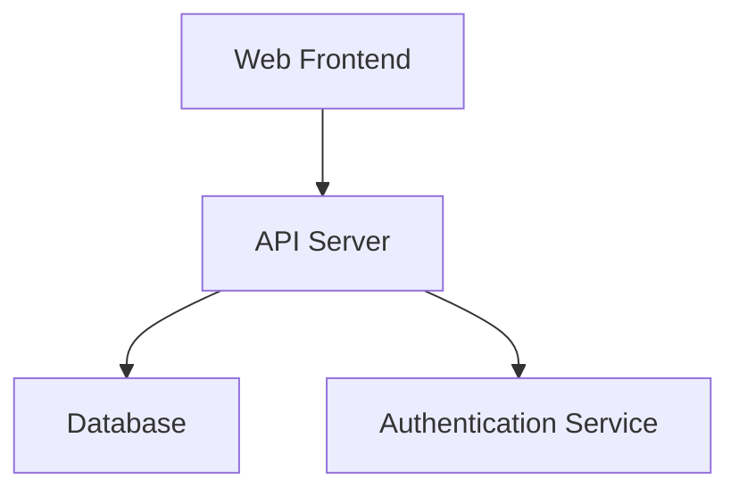

システム全体の構造  
技術スタックの選定理由  
コンポーネント間の関係  
インフラ構成  
セキュリティ設計  
スケーラビリティの考慮  

# Architecture Document

## System Overview

## Memo
Optimismチェーン  
Torus  
AWSのAPI Gateway  
Lambda  
DynamoDB  
Slack  

~~あなたは〇〇番目の挑戦者です…！って出そうかな~~  
~~ウォレットが接続できるようになりましたというのが1万人まで(予算都合)~~  
バッジ一覧らしきURLを出す、Gatherに並ぶ、ウォレット接続できるようになっている隠しページをGatherで案内(有効化リンク)、バッジページTorus接続、Twitter ID分かる、TwitterIDがSlack通知くる、そのIDに配布する